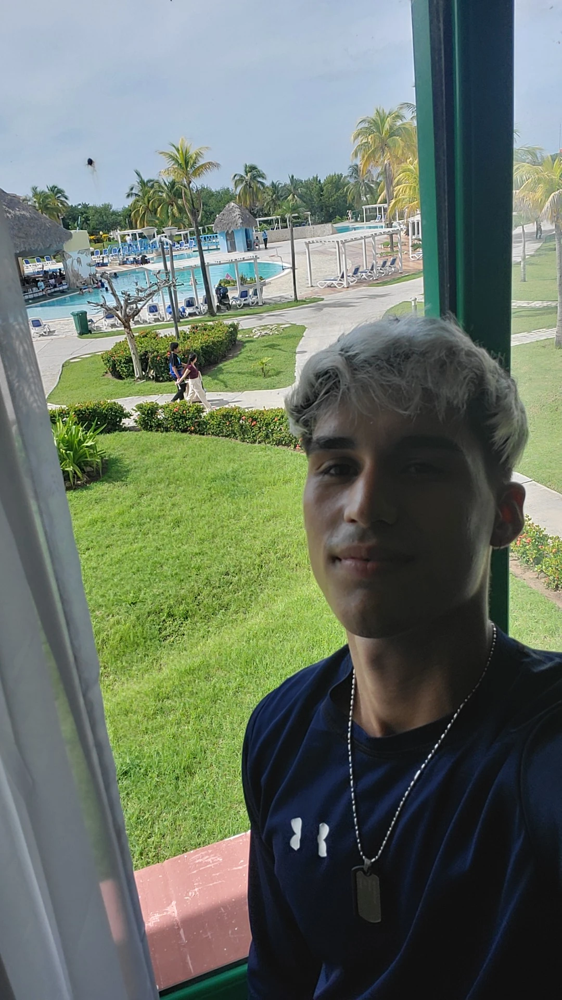

# ¡Hola! Soy Lionny 👋

  

<h3 align="center">⚙️ Estudiante de Ingeniería Automática | 💻 Desarrollador Backend en Formación</h3>

  🌐 <b>Disponible para Oportunidades de Trabajo Remoto</b>

  
  

---

# 🚀 Sobre mí

Soy estudiante de **Ingeniería Automática**. Mi formación académica me otorga una estructura sólida para resolver problemas complejos, modelar sistemas y entender el flujo de datos desde el hardware hasta el software.

He enfocado mi camino en el **desarrollo Backend**, especializándome de forma autónoma en el ecosistema de **C# y ASP.NET**, la gestión de bases de datos con **PostgreSQL** y el uso diario de **entornos Linux (WSL)**. 

*Este perfil de GitHub es donde iré subiendo mis proyectos académicos, laboratorios y desarrollos personales a medida que avanzo en mi aprendizaje.*

---

## 🛠️ Stack que estoy utilizando

### **Lenguajes y Tecnologías de Enfoque**

### **Entorno y Herramientas**

---

## 🗣️ Idiomas

*   **Español:** Nativo.
*   **Inglés (Intermedio):** Capacidad para lectura fluida de documentación técnica, redacción de código limpio siguiendo estándares internacionales y comunicación escrita en entornos de trabajo distribuidos.

---

## Mis Próximos Pasos

Para complementar mis estudios de ingeniería y prepararme para entornos profesionales remotos, actualmente estoy trabajando en:

*   📖 **Consolidación de Fundamentos:** Implementación de estructuras de datos y algoritmos limpios en C# y C++.
*   🐳 **DevOps Básicos:** Aprender los fundamentos de Docker para el aislamiento de aplicaciones.
*   🐧 **Entornos Linux:** Automatización de tareas locales mediante Shell Scripting y personalización de la terminal.

---

## 🌐 Conectemos

Si estás interesado en colaborar en un proyecto, tienes una propuesta de desarrollo de software o simplemente quieres hablar de código e ingeniería, encuéntrame en:

 

<!-- BOTÓN DE YOUTUBE OCULTO 

-->
